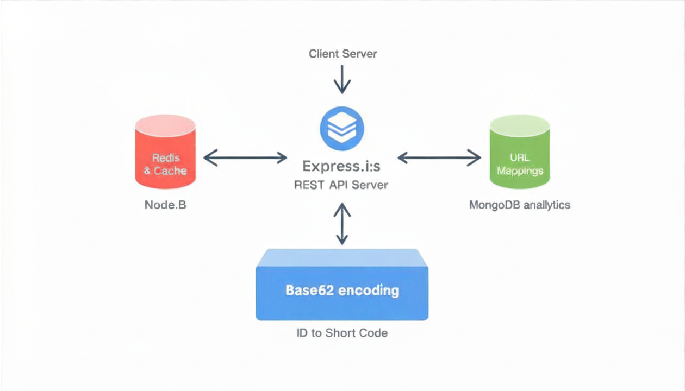

# URL Shortener Backend

A backend URL shortener built with Node.js, Express, MongoDB, and Redis.

The service creates short URLs, redirects users to the original URL, tracks click counts, caches redirect data in Redis, supports link expiry, and protects URL creation with a Redis token bucket rate limiter.

## Live Demo

Base URL:

```text
https://url-shortener-backend-yqk1.onrender.com
```

Health check:

```bash
curl https://url-shortener-backend-yqk1.onrender.com/health
```

Create a short URL:

```bash
curl -X POST https://url-shortener-backend-yqk1.onrender.com/shorten \
  -H "Content-Type: application/json" \
  -d "{\"url\":\"https://example.com\",\"ttlDays\":30}"
```

## Features

- Create short URLs using `POST /shorten`
- Redirect short URLs using `GET /:code`
- Track total clicks for each short URL
- View link stats using `GET /:code/stats`
- Store URL data in MongoDB
- Use Redis cache-aside pattern for redirects
- Expire links using `expiresAt`
- Return `410 Gone` for expired links
- Rate limit URL creation using a Redis token bucket
- Benchmark redirect performance using autocannon

## Tech Stack

- Node.js
- Express.js
- MongoDB
- Mongoose
- Redis
- ioredis
- Docker
- Render
- MongoDB Atlas
- Upstash Redis
- autocannon

## Local Setup

Clone the repository:

```bash
git clone https://github.com/Disha1027/URL-shortener-backened.git
cd URL-shortener-backened
```

Install dependencies:

```bash
npm install
```

Create a `.env` file:

```env
PORT=3000
BASE_URL=http://localhost:3000
MONGO_URI=mongodb://localhost:27017/url_shortener_practice
REDIS_URL=redis://localhost:6379
```

Start MongoDB and Redis:

```bash
docker compose up -d
```

Start the server:

```bash
npm run dev
```

Health check:

```bash
curl http://localhost:3000/health
```

Expected response:

```json
{
  "status": "ok"
}
```

## API Endpoints

### Create Short URL

```http
POST /shorten
```

Request body:

```json
{
  "url": "https://example.com",
  "ttlDays": 30
}
```

Response:

```json
{
  "originalUrl": "https://example.com",
  "shortCode": "abc123",
  "shortUrl": "http://localhost:3000/abc123",
  "expiresAt": "2026-07-13T10:00:00.000Z"
}
```

### Redirect Short URL

```http
GET /:code
```

Returns a `302` redirect to the original URL.

Possible errors:

```json
{
  "error": "short url not found"
}
```

```json
{
  "error": "short url expired"
}
```

### Get Stats

```http
GET /:code/stats
```

Response:

```json
{
  "originalUrl": "https://example.com",
  "shortCode": "abc123",
  "clicks": 5,
  "createdAt": "2026-06-13T10:00:00.000Z",
  "expiresAt": "2026-07-13T10:00:00.000Z"
}
```

## Caching Strategy

The redirect endpoint uses a cache-aside pattern.

When a user visits a short URL:

1. The server checks Redis for `url:{code}`.
2. If found, it redirects immediately and updates clicks in MongoDB.
3. If not found, it fetches the URL from MongoDB.
4. Then it stores the result in Redis with a TTL.
5. Finally, it redirects the user.

## Rate Limiting

`POST /shorten` is protected using a Redis token bucket rate limiter.

Default behavior:

- Bucket capacity: 20 tokens
- Refill rate: 1 token per second
- If no tokens are available, the API returns `429 Too Many Requests`

## Benchmark

Redirect endpoint benchmarked locally using autocannon:

```bash
npx autocannon -c 50 -d 10 http://localhost:3000/YOUR_CODE
```

Recorded local result:

```text
Cold Redis:
p99 latency: 61 ms
avg req/sec: 1440.1

Warm Redis:
p99 latency: 58 ms
avg req/sec: 1416.6
```

Note: local benchmark results depend on machine resources and Docker performance.

## Deployment

The project is deployed using:

- Render for hosting the Node.js API
- MongoDB Atlas for the production MongoDB database
- Upstash Redis for production Redis caching and rate limiting

Production environment variables:

```env
BASE_URL=https://url-shortener-backend-yqk1.onrender.com
MONGO_URI=<MongoDB Atlas connection string>
REDIS_URL=<Upstash Redis connection string>
NODE_ENV=production
```

## Screenshots

### System Design Diagram



## What I Learned

- How Express handles API routes and middleware
- How MongoDB stores URL metadata
- How Mongoose models define database structure
- How Redis can reduce database reads on redirect paths
- How TTL expiry works for short links
- How token bucket rate limiting smooths request bursts
- How to benchmark backend endpoints using autocannon
- How to deploy a backend service using Render, MongoDB Atlas, and Upstash Redis
